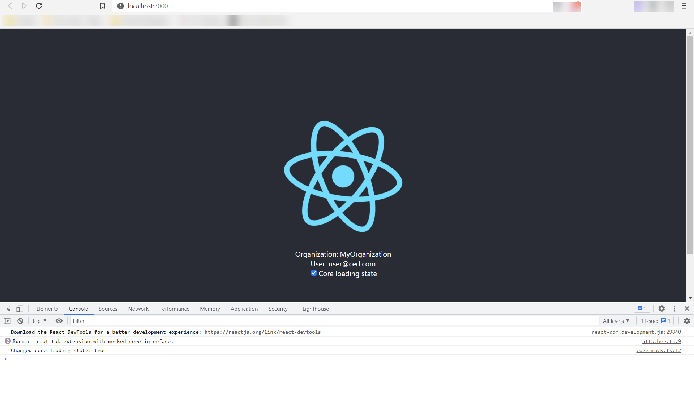
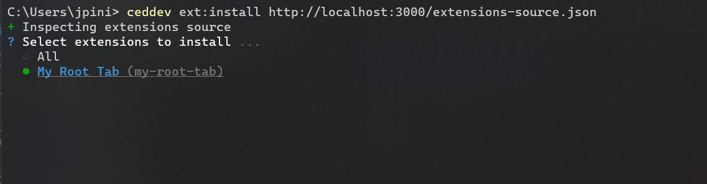
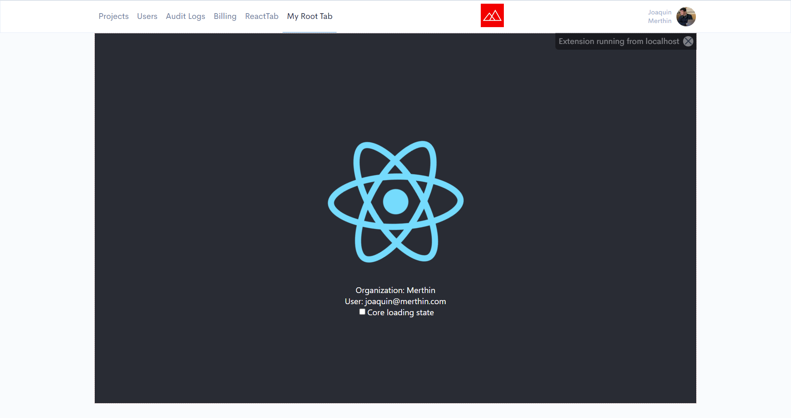

# Create a React root tab extension

This guide will walk you through the steps to create a [root tab extension](../glossary/RootTabExtension.md) for CED.

## Create a React app

Let's create a React app, in this case using `create-react-app` with `typescript` template. You may use any other way to bootstrap the application.

```bash
$ npx create-react-app my-root-tab --template typescript
```

## Install the Root Tab Extension SDK

We need to include the root tab extensions library in our dependencies.

```bash
$ cd my-root-tab
$ npm install @ced/root-tab-extension
```

If you get an error indicating that the package was not found, check how to [authenticate to Merthin NPM Registry](./authenticate-to-merthin-npm-registry.md).

## Create the extensions source

Create a file under `public` folder named `extensions-source.json` for the [extensions source](../glossary/ExtensionsSource.md) and fill it with the following content. This json file should be accessible from a public URL once deployed.

```json
{
  "version": "1.0.0",
  "extensions": [
    {
      "id": "my-root-tab",
      "name": "My Root Tab",
      "description": "This is a root tab for CED",
      "icon": "logo192.png",
      "tabId": "my-root-tab",
      "tabTitle": "My Root Tab",
      "tabUrl": "/",
      "position": 4,
      "admin": false,
      "type": "root-tab"
    }
  ]
}
```

Use `position` property to change the position of the tab in CED top bar. Use `admin` to determine if the tab should be visible only for administrators. Properties `id` and `tabId` should be unique for all installed root tab extensions. Use `tabUrl` property to target the route in your React app that you want to expose as the root tab.

## Connect with CED Core from the extension

Replace the `src/App.tsx` file with the following content.

```typescript
import React, { useEffect, useState } from 'react';
import logo from './logo.svg';
import './App.css';
import { attachToCore, CoreInterface } from '@ced/root-tab-extension';

function App() {
  const [core, setCore] = useState<CoreInterface>();
  const [organization, setOrganization] = useState<string>();
  const [user, setUser] = useState<any>();

  useEffect(() => {
    (async () => {
      const core = await attachToCore();
      const [org, user] = await Promise.all([
        core.getOrganization(),
        core.getUser(),
      ]);
      setOrganization(org);
      setUser(user);
      setCore(core);
    })();
  }, []);

  const handleChange = (event: React.ChangeEvent<HTMLInputElement>) => {
    core?.setLoading(event.target.checked);
  };

  return (
    <div className="App">
      <header className="App-header">
        
        <div>Organization: {organization}</div>
        {user && <div>User: {user.email}</div>}
        <label>
          <input
            type="checkbox"
            defaultChecked={false}
            onChange={handleChange}
          />
          Core loading state
        </label>
      </header>
    </div>
  );
}

export default App;
```

Let's go step by step through all the modifications.

```typescript
import { attachToCore, CoreInterface } from '@ced/root-tab-extension';
```

Import root tab extensions APIs. `attachToCore` is a function that establishes the connection with the core SPA. `CoreInterface` defines the APIs in the core that can be called from the extension in order to communicate with the main UI.

```typescript
const [core, setCore] = useState<CoreInterface>();
const [organization, setOrganization] = useState<string>();
const [user, setUser] = useState<any>();
```

We prepare some state variables for the `core` object, the current organization and the user data.

```typescript
useEffect(() => {
  (async () => {
    const core = await attachToCore();
    const [org, user] = await Promise.all([
      core.getOrganization(),
      core.getUser(),
    ]);
    setOrganization(org);
    setUser(user);
    setCore(core);
  })();
}, []);
```

We call `attachToCore` on component start in order to establish the connection with CED UI. This will return the `core` object. Next we invoke a couple of functions in `core` to get the organization and the user data. Finally we set the data to the state variables.

```typescript
const handleChange = (event: React.ChangeEvent<HTMLInputElement>) => {
  core?.setLoading(event.target.checked);
};
```

This is a callback we defined to invoke `setLoading` in the main UI. This will set the CED UI into a general loading state.

```typescript
return (
  <div className="App">
    <header className="App-header">
      
      <div>Organization: {organization}</div>
      {user && <div>User: {user.email}</div>}
      <label>
        <input type="checkbox" defaultChecked={false} onChange={handleChange} />
        Core loading state
      </label>
    </header>
  </div>
);
```

Finally, we render the state variables and connect a checkbox component with the callback that changes the loading state.

## Changes to global styles

Replace `src/App.css` with the following content.

```css
.App {
  text-align: center;
}

.App-logo {
  height: 20em;
  pointer-events: none;
}

@media (prefers-reduced-motion: no-preference) {
  .App-logo {
    animation: App-logo-spin infinite 20s linear;
  }
}

.App-header {
  background-color: #282c34;
  height: 50em;
  display: flex;
  flex-direction: column;
  align-items: center;
  justify-content: center;
  color: white;
}

.App-link {
  color: #61dafb;
}

@keyframes App-logo-spin {
  from {
    transform: rotate(0deg);
  }
  to {
    transform: rotate(360deg);
  }
}
```

The original content has some height values with viewport units like `vh` and `vmin`. Usually this is not what we want for an extension so we changed it to `rem` units.

## Run the extension detached from CED

CED extensions need to run inside CED. This is not convenient for the first stages of local development. To overcome this requirement we can mock the `core` object obtained from the `attachToCore` function.

First create a file `src/core-mock.ts` with the following content.

```typescript
import { CoreInterface } from '@ced/root-tab-extension';

export const coreMock: CoreInterface = {
  getUser: async () => ({
    email: 'user@ced.com',
  }),
  isUserAdmin: async () => true,
  getAccessToken: async () => '1234567890',
  getOrganization: async () => 'MyOrganization',
  getCoreApiBaseUrl: async () => 'https://core-api.ced-dev.merthin.systems',
  goToRoute: async (url: string) => console.log(`Requested core route: ${url}`),
  setLoading: async (value: boolean) =>
    console.log(`Changed core loading state: ${value}`),
  unload: async () => console.log(`Unloaded extension`),
};
```

This is a fake `core` object with mock implementations for its APIs. We'll use it with `attachToCore` so we don't need to attach to the real CED core UI.

Go to `src/App.tsx` and import the core mock we created above.

```typescript
import { coreMock } from './core-mock';
```

Change the invokation to `attachToCore` so it receives the mock.

```typescript
const core = await attachToCore({
  coreInterfaceMock: coreMock, //Use mocked core
});
```

Run the React app and navigate to http://localhost:3000/

```bash
$ npm run start
```

You should be able to see the extension rendering the mocked data. A message in the JavaScript console "Running root tab extension with mocked core interface." will indicate that the extension is effectively running with the mocked core. By clicking the "Core loading state" checkbox a mock function will print the event in the JavaScript console.



## Run the extension from your local environment in CED Dev

Run the React application in your local environment.

```bash
$ npm run start
```

Install the extension in CED Dev by referencing the `extensions-source.json` file we created above.

```bash
$ ceddev ext:install http://localhost:3000/extensions-source.json
```

Make sure to have [CED Dev CLI](../../cli/) installed with the [extensions management commands](../../libs/cli-extensions/ced-cli-extensions-management/). This command will prompt you with a list of extensions exposed in the `extensions-source.json` file. Select `My Root Tab (my-root-tab)` which is the only option at this point.



Navigate to CED Dev https://ced-dev.merthin.systems/. You should be able to see a new root tab with your React application. It will render the current organization in CED and the user's email. By clicking the "Core loading state" checkbox you should be able to activate or deactivate the loading state in the main UI.



Notice there's an indicator at the top-right corner to remember us this is running from your local development environment. Remember to uninstall locally built extensions from CED Dev after testing them.

## Uninstall the local extension from CED Dev

Run the following command to uninstall extensions by its type. Select your local extension in order to uninstall it.

```bash
$ ceddev ext:uninstall root-tab
```
