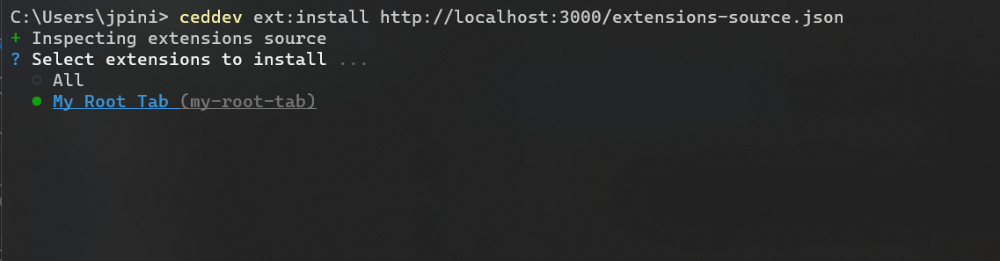
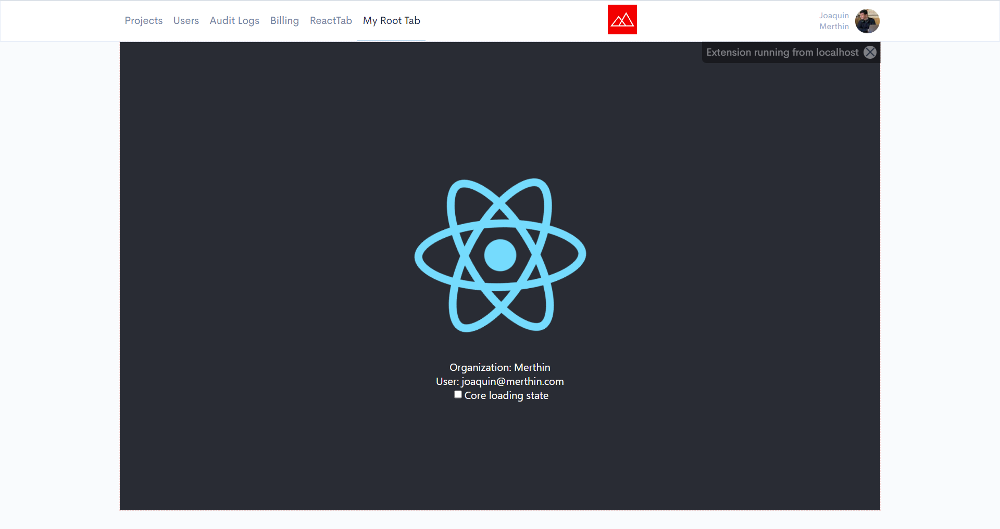

# Install extension from local development environment

This tutorial applies to all kind of extensions. Make sure to have [CED Dev CLI](./install-cli.md) installed with the [extensions management commands](../../libs/cli-extensions/ced-cli-extensions-management/).

## Run the extension locally

Start by running the extension in local development environment with whatever script you defined for that. For instance, `npm run start`.

## Install the local extension in CED Dev

Install the extension in CED Dev by referencing its `extensions-source.json` file. Replace `http://localhost:3000/extensions-source.json` with the URL of the local `extensions-source.json` file.

```bash
$ ceddev ext:install http://localhost:3000/extensions-source.json

```

This command will prompt you with a list of extensions exposed in the `extensions-source.json` file. Select the extensions you want to install.



You should be able to run the new extension on the corresponding extensibility point in CED Dev https://ced-dev.merthin.systems/.

Notice there's a message at the top-right corner to indicate this extension is running from your local development environment. Remember to uninstall locally built extensions from CED Dev after testing them.



## Uninstall the local extension from CED Dev

Run the following command to uninstall extensions by its type. Select your local extension in order to uninstall it.

```bash
$ ceddev ext:uninstall root-tab
```
